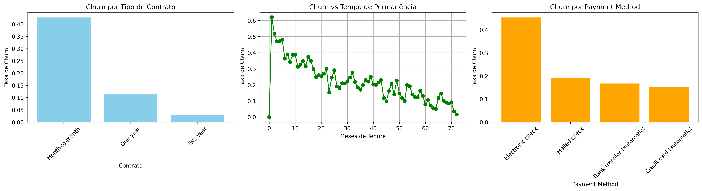

# IBM Customer Churn Analysis

### Dashboard Overview

## Objetivo

Analisar o churn (cancelamento) de clientes da Telco para identificar padrões de risco, fatores de retenção e insights estratégicos para tomada de decisão.

O notebook inclui:

- Análise exploratória de dados (EDA)
- Limpeza e tratamento de dados
- Taxa de churn por variáveis numéricas e categóricas
- Dashboard com KPIs e gráficos
- Interpretação de insights de negócio

## Ferramentas utilizadas

    Python
    Jupyter Notebook
    Pandas
    Matplotlib
    Git

## Estrutura do projeto

    customer-churn-analysis/
    │
    ├── data/
    │ └── Telco_customer_churn.xlsx
    ├── notebooks/
    │ └── churn_analysis.ipynb
    ├── src/ # funções Python opcionais
    │ └── utils.py
    ├── requirements.txt
    ├── README.md
    └── .gitignore

## Como executar

1. Clonar o repositório:

    git clone https://github.com/jhonnydarko/customer-churn-analysis.git
    cd customer-churn-analysis

## Criar e ativar ambiente virtual:

    python -m venv venv
    source venv/Scripts/activate   # Windows + bash

## Instalar dependências:

    pip install -r requirements.txt

## Abrir notebook:

    jupyter notebook notebooks/churn_analysis.ipynb

## Principais Insights

1. Tempo de Permanência (Tenure Months)

    Correlação negativa com churn: -0.352
    Clientes novos têm risco muito maior de cancelar
    Estratégia: priorizar retenção de clientes recém-contratados

2. Tipo de Contrato (Contract)

    Month-to-month: 42,7% de churn
    One year: 11,3%
    Two year: 2,8%

Insight: contratos mensais são os “maiores ofensores” → foco de campanhas de fidelização

3. Cobranças Mensais (Monthly Charges)

    Correlação positiva: 0.193
    Clientes com valores altos tendem a cancelar mais
    Estratégia: analisar planos de preço ou benefícios diferenciados

4. Total Charges

    Correlação negativa: -0.199
    Clientes com histórico de faturamento maior tendem a permanecer
    Insight: fidelização de clientes antigos é importante

5. Serviços Adicionais

    Tech Support, Streaming TV/Movies, Paperless Billing mostram pequenas diferenças

Insight: serviços podem atuar como fatores de retenção ou risco

## Dashboard

O notebook contém um dashboard visual que combina:

    1. KPIs principais: total de clientes, total de churn, taxa média, clientes Month-to-month
    2. Gráficos de barras: churn por contrato, método de pagamento, tipo de internet
    3. Linha temporal: churn vs tempo de permanência

O dashboard permite rapidamente identificar os clientes de maior risco e fatores que influenciam o churn.